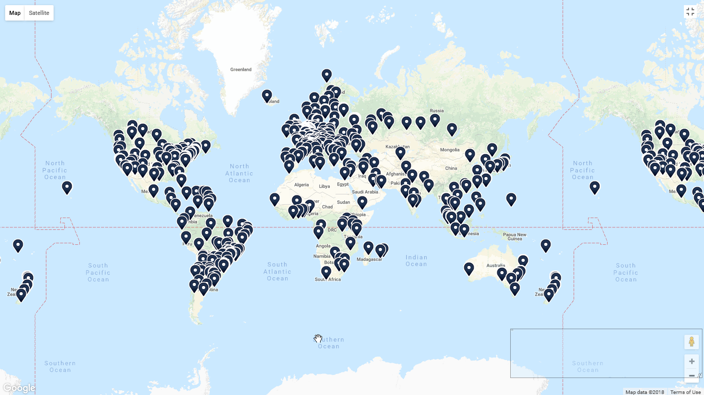

# MeshBase
## Abstract
MeshBase is an unusual kind of [Content Delivery Network (CDN)](https://en.wikipedia.org/wiki/Content_delivery_network). It is a [peer-to-peer](https://en.wikipedia.org/wiki/Content_delivery_network#Peer-to-peer_CDNs) CDN designed to serve end users in markets that lack affordable high-speed Internet connections. Rather than build out its own infrastructure, which is a costly endeavor, it seeks to make more efficient use of existing infrastructure in those markets by leveraging resource sharing. 

CDNs enable spatial distribution of content to end users[1](#ref1) -- they allow download requests for content to be fulfilled by servers that are geographically close to the location of the requesting end user. This approach to content distribution allows download requests to complete faster, reduces bandwidth costs and increases the likelihood that the content will be available for consumption in future[2](#ref2). 

In other words, CDNs enable quick, cheap and reliable delivery of content to end users, but for end users to enjoy these triple benefits, significant amounts of capital need to be committed upfront to build out a geographically distributed network of proxy servers and data centers. Such infrastructure investments are sorely lacking in emerging markets where cheap capital is less plentiful and low productivity is widespread.  

The pilot will focus on content delivery within academic communities in emerging markets, specifically: enabling shared access to high-bandwidth educational content like video recordings of lectures from MOOCs that freely permit redistribution under a permissive license to African learners.

# 1.0. CDNs: A Quick Primer
## 1.1. Background
This chapter will highlight the immense value proposition of using CDNs to deliver content quickly, cheaply and reliably by progressively introducing terms used by the CDN industry.

### 1.1.1. Origin Server
Content providers typically host content on servers in infrastructure they control. These servers are called *origin servers*.

### 1.1.2. Edge Server
Under the hood, traditional CDNs earn their keep by replicating (high-bandwidth) content from their clients' origin servers to external servers running inside networks under their control. These external servers are called *edge servers* and are an essential part of the geographically distributed network maintained by CDNs. 

They are called edge servers because they *reside at the edge of the network* -- they facilitate the exchange of traffic between different networks, typically between a private network and the Internet[3](#ref3). Edge servers are the most cost-effective way to deliver content to ISPs for onward delivery to end users. ISPs are essentially a private network through which most end users access the Internet.

### 1.1.3. Internet Exchange Point (IXP)
[Interconnection](https://en.wikipedia.org/wiki/Interconnection), or the exchange of traffic between different networks typically happens inside a [facility](https://superuser.com/questions/751076/difference-between-point-of-presence-access-point-and-domain-autonomous-system/751827#751827) called an Internet exchange point (IX or IXP). An *IXP is essentially a data center containing network switches that route traffic between the different member companies that share the costs of maintaining the physical infrastructure.*[4](#ref4) 

**Fig. 1.0: Map of the world showing Internet exchanges**

(Map data ©2018 Google. Image courtesy of [TeleGeography](http://www.telegeography.com/)[5](#ref5))

# 2.0. Africa: CDN Challenge
The diagram in **Figure 1.0** shows a map of all known Internet exchange points in the world. 

In terms of land mass, Africa is greater than USA, China, India, Japan and all of Europe ... combined![6](#ref6) But this fact[7,](#ref7)[8](#ref8) is not immediately apparent from looking at the map due to the use of the [Mercator projection](https://en.wikipedia.org/wiki/Mercator_projection), which is known to convey a distorted perception of the overall geometry of the planet.[9](#ref9) 

## 2.1. Challenge #1: Low Internet Usage
Notice how, inspite of Africa's enormous land mass, it has fewer IXPs relative to the rest of the world. An abundance of IXPs correlates directly with capacity to route Internet traffic cost effectively. In the case of Africa and markets similar to it, the lack of IXPs translates directly into higher costs relative to more developed markets, which in turn limits demand for the consumption of Internet-based applications. 

## 2.2. Challenge #2: Infrastructure Deficit
There are two (2) major reasons why Africa's Internet utilization is low, relative to other more developed markets.

### 2.2.1. Inadequate IXPs 
The first major reason is because Sub-Saharan Africa[13](#ref13) does not yet have the requisite level of data center infrastructure needed to reap the benefits of economies of scale. Among the benefits of operating at scale is that, Internet traffic between local parties that is currently being routed through expensive transit links that are outside the continent would no longer be economically viable. Instead, such local traffic would be routed through IXPs within the continent. 

The current situation, referred to as the *[trombone effect](https://blog.telegeography.com/what-is-the-trombone-effect)* or *tromboning*[10](#ref10), has a number of implications for both content providers and end users that are resident on the continent. 
- For African content providers, hosting content abroad is far cheaper than local hosting, even though end users are in Africa. 
- For African end users, the use of foreign transit links to route local traffic increases latency significantly. 

### 2.2.2. Erratic Power
The second major reason is the high cost of operating data centers due the prevalence of [rolling blackouts](https://en.wikipedia.org/wiki/Rolling_blackout). 

A lot of African countries are still [developing](https://en.wikipedia.org/wiki/Developing_country) which affects their ability to generate enough power to meet the growing needs of their population, leading to a classic case of demand outstripping supply. Situations where demand exceeds supply naturally results in rationing, in the form of regular power cuts by utility companies, to avoid a total shutdown of the system.[14](#ref14)

A common characteristic of developing economies is that the workforce is concentrated in [primary sectors](https://en.wikipedia.org/wiki/Primary_sector_of_the_economy), which contrasts sharply with developed economies, where the workforce is concentrated in secondary and tertiary sectors[15](#ref15). As a result, developing economies do not yet enjoy the kinds of high productivity that developed economies enjoy after becoming industrialized. 

Industrialization essentially involves making an economy's primary sectors more technologically advanced by replacing human labor with machinery. Deployment of advanced machinery is capital-intensive but developing economies lack access to cheap capital.

### 2.2.3. Summary
High costs of capital leads to high costs to provide basic infrastructre. High infrastructure costs limit full utilization of installed Internet capacity, which in turn affects investment decisions to further expand the continent's installed capacity to achieve economies of scale.

## 2.3. Obvious Solution: Infrastructure Investments
From the summary above, the solutions to Africa's problem of infrastructure paucity may seem blindingly obvious -- *access to cheap capital* will allow businesses to invest in more IXPs and related infrastructure, but some discussions[13](#ref13) of the challenges do not mention this crucial angle.

Regardless, even if cheap capital were suddenly available, there are a few nuances that need to be accounted for.

### 2.3.1. Network Externalities
IXPs in particular, exhibit peculiar characteristics[11](#ref11) which economists call a *network externality* or *network effect*. *When a network effect is present, the value of a product or service increases proportionally with the number of others using it.*[12](#ref12)

*IXPs are a special case of this effect; the value of an Exchange Point is not the number of participants but a slightly more complex calculation including the number and uniqueness of the routes and volume of traffic peered.*[11](#ref11)

In other words, the value of a new IXP to an ISP is proportional to the amount of traffic the ISP can exchange in peering relationships at the IXP. A new IXP will start out with zero or a few founding ISP members, but over time it will face the challenge of attracting additional peers into a facility where there are not many customers to peer with.[11](#ref11) 

This phase in an IXP's growth is the *lower asymptote* part of the [S-curve](https://en.wikipedia.org/wiki/Sigmoid_function) or logistic curve,[16](#ref16) which is a mathematical model that describes the growth of one variable in terms of another variable over time. The S-curve helps describe, and sometimes predict, the growth of businesses with network-like characteristics, over a period of time.[17](#ref17)

Once peering at the IXP reaches critical mass, where the value of participation exceeds the cost of participation, the new IXP will experience exponential growth,[11](#ref11) until it reaches maturity, which is the *upper asymptote* on the S-curve, after which growth tapers off.

### 2.3.2. Transaction Costs
The primary business of an IXP is to make the exchange of network traffic cost-effective, but to provide such a service reliably, it must incur the cost of powering its data center facilities using redundant sources of power. This cost is what economists call a [transaction cost](https://en.wikipedia.org/wiki/Transaction_cost)[18](#ref18) and is higher in less industrialized African countries than in developed countries, another consequence of the infrastructure deficit. 

In fact, a significant part of the operating costs of data center infrastructure is the electricity needed to power the facility. This is a major reason why Internet giants like Google[20,](#ref20)[21](#ref21) and Amazon site data centers close to regions with cheap energy sources like hydroelectric power plants. The other factors that affect where a data center is sited include developable land, fibre infrastructure, local workforce and tax incentives.

With high electricity costs in effect, a sudden critical mass of IXPs will not translate into significantly lower prices unless a key transaction cost -- electricity costs -- are also made highly competitive.

To rein in the high costs of electricity on the continent will require concerted policy efforts by individual African governments and there are 54 of them.[19](#ref19) Such interventions are necessary to engender increased funding, competent management and ultimately strong competition. A competitive market is necessary for electricity consumers to enjoy lower prices.

### 2.3.3. Summary
Access to cheap capital will not necessarily solve the challenges posed by the continent's infrastructure deficit. Significant effort will be required by individual African governments to disband entrenched monopolies that run the existing electricity grids inefficiently, which has lead to high electricity costs relative to developed countries.

## 2.4. Non-obvious Solution: Offline Sharing and Wireless Community Networks
The obvious solution is capital-intensive which makes it unlikely to materialize continent-wide any time soon. This is because, in spite of recent advances in terms of political stability and economic prosperity, significant political risks still exist which adds a certain amount of uncertainty to the scarce capital looking for viable investments to fund.

There are interesting solutions from South America, specifically from embargo-laden Cuba that has low capital requirements relative to the obvious solution: sharing content offline and wireless community networks. 

Offline sharing is the sharing of content without the use of a computer network. This method is also referred to as a [*Sneakernet*](https://en.wikipedia.org/wiki/Sneakernet) because humans constitute the primary mechanism through which data is transported. [Wireless community networks](https://en.wikipedia.org/wiki/Wireless_community_network) are community-driven Wi-Fi networks. They are typically [adhoc](https://en.wikipedia.org/wiki/Wireless_ad_hoc_network) in nature such that they do not depend on the pre-existence of centrally managed infrastructure.

### 2.4.1. Cuba
Cuba bears a lot of similarities to several African countries: prices for high-speed Internet service are high and power cuts are so common[23](#ref23). They have one of the lowest internet penetration rates in the world, with less than 5% of the island’s 11 million people having Internet access.[23,](#ref23)[24](#ref24) 

The high cost and low speed are the result of a poor infrastructure, similar to the African situation, and the communist government’s non-chalance toward the spread of information. The island’s only fibre-optic cable was connected by Venezuela several years ago, but it has limited capacity and the benefits haven’t spread widely due to poor telecom networks on the island.[23](#ref23)

Cuba is an island that is literally and metaphorically cut off from the rest of the world, but the island's many restrictions has led to some interesting DIY workarounds for distributing content to end users.[25](#ref25)

### 2.4.2. El Paquete Semanal
*El Paquete Semanal* or *El Paquete* for short, translated as "The Weekly Package", is a one terabyte collection of digital content distributed using external hard drives since around 2008 on the underground market in Cuba as a substitute for broadband Internet.[22](#ref22)

Essentially, *El Paquete* "is the Internet distilled down to its purest, most consumable, and least interactive form: its content."[25](#ref25)

#### 2.4.2.1. Usage
The Guardian describes it in more detail:
*The terabyte-per-week service is cheaper than most Internet providers. Prices range from $17 for the latest Friday upload (which is mostly paid by those who want to resell to their own customers) to $2.50 for copies made between Tuesday and Thursday, when the content is already a few days old and thus has little resale value.*[23](#ref23)

*The Weekly Package makes for a very passive experience. It is, of course, close to useless for blogging, social networking and other interactive – and politically dynamic – forms of communication. Driven by memory size rather than processor speed, it brings with it an emphasis on storage rather than activity. This is also evident in the very different Cuban use of Wikipedia, which many people download in bulk packages of two to five gigabytes and keep on their mobile phones so they can use it without being online.*[23](#ref23)

#### 2.4.2.2. Administration
Each weekly *paquete* travels around the island from person to person and percolates quickly from Havana, Cuba's capital, to the furthest reaches, even though its distribution is considered "un-legal" by the Cuban government. The weekly collection of video, song, photo, and text files from the outside world is cobbled together by various media smugglers known as *paqueteros* and there are half-dozen of them, [25](#ref25)working to keep the weekly package free of illegal content such as political, religious or sexual content, that would cause the government to outlaw their activities.

### 2.4.3. SNET: Street Network
Street Network or SNET[27](#ref27) started out as a gaming and entertainment network in 2012[26](#ref26) before exploding in popularity and gradually morphing into an all-encompassing intranet, stretching outside the bounds of Havana to parts of other provinces. 

#### 2.4.3.1. Usage
Cubans use the SNET intranet to browse local reproductions of popular consumer Internet services including Facebook, Instagram, Twitter, Reddit and Craigslist.[25,](#ref25)[26](#ref26) They also use it to stream entertainment and share content from the weekly *paquetes*.[25](#ref25) Membership of SNET is not open to all Cubans: "if you're a member, you're not supposed to talk to non-members about it. And to become a member you need to have an existing member vouch for you."[26](#ref26)

#### 2.4.3.2. Administration
*SNET is composed of nine main hubs, or "pilares", and a tangled web of 100-meter Ethernet cables and wireless access points.*[25](#ref25) 

The SNET is overseen by volunteers network administrators that see to it that the network never veers into illegality[25](#ref25) like the distribution of sexual content. Unlike the weekly package, access to the network is free but using SNET to access the Internet is not allowed. To maintain this stance, network administrators are expected to abide by certain rules and violators get kicked out[26](#ref26) if found breaking any of the cardinal rules.

### 2.4.4. Summary
Both solutions involve strong layers of trust in the distribution of content to end users and in the administration of the distribution network. 

In the next chapter, we will review a potential solution for the African continent that is a hybrid of the approaches used by Cubans but made more robust by the use of a blockchain-based solution.

# 3.0 Africa: CDN Solution
## 3.1. Design Goals
The following are key design goals for any proposed solution to the CDN challenge be viable in Africa:
* Affordable - low cost distribution of content
* Integrity - easy to police rogue content
* Discovery - easy to surface & consume content
* Sustainable - built-in incentives to sustain the network

### 3.1.1. Affordable
To keep costs low, rather than build own infrastructure, proposals should seek out existing infrastructure and try to maximize usage of such investments. Essentially, the core of any solution should involve sharing existing assets, that is, piggyback on the current trend of using software to make access to existing infrastructure more efficient aka the sharing economy; a trend popularized by Uber and AirBnb which are startups with billion-dollar valuations. 

The approach of using software systems that exploit network effects to improve utilization of infrastructure that suffers from *"severe shortages of resource supply and excessive demand"* is currently referred to as *societal networks* and is an active area of research at universities like Stanford[29](#ref29) and Princeton[30](#ref30). 

A major benefit of this approach is that it is future-proof -- it allows taking advantage of new capacity as it becomes available. Somalia, an East African country, recently commissioned the country's first ever IXP on May 17th, 2018[28](#ref28) -- barely a week ago from when the first draft of this whitepaper was published. These investments are still being made, they just take a long time to gestate and become operational.

### 3.1.2. Integrity
Digital content is by nature easily falsifiable information -- anyone can put out fake or adulterated content pretending to be the real deal on the Internet. Videos in particular are a high-bandwidth form of digital content, which means that an unsuspecting user will have expended valuable bandwidth to download fake content before realizing it's fake. In other words, there's an opportunity cost for every fake video that is downloaded -- the user could have spent their bandwidth on something genuine.

In wealthy nations, the opportunity cost is low, negligible even, due to the prevalence of high-bandwidth Internet at homes and offices. In emerging markets, the opportunity cost is high due to the paucity of telecoms infrastructure necessary to make high-bandwidth Internet access affordable. So it is important that our solution properly solves this and related issues:

* malware masquerading as legitimate content; 
* legitimate content distributed using invalid formats;
* old or outdated copies of legitimate content.

The blockchain offers a number of benefits in tackling the above problems:
  - the immutable nature means no content is lost especially due to censorship[31,](#ref31)[32](#ref32);
  - the public nature will make illegitimate content easier to police;
  - the untrusted nature eliminates the challenge of who to trust (nodes), which can be a [bottleneck](https://en.wikipedia.org/wiki/Single_point_of_failure), for actions requiring consensus.

### 3.1.3. Discovery
A viable proposal, no matter how well-engineered, must be designed with usability in mind, otherwise such a solution will never reach the kind of critical mass necessary to make it widely adopted. This property is a significant factor towards gaining a foothold in any market, and is based on a well-studied concept in economics called *switching costs*.[33](#ref33)

So it is important that, from a user experience perspective, the solution has a really low learning curve -- the solution must be easy to use to surface and consume content for end users, while also being easy to set up and maintain for users who intend to publish or distribute content to end users.

### 3.1.4. Sustainable
The rise of MOOCs has led to several life-changing stories, even for learners in war-torn places like Syria,[34](#ref34) but it is important that in addition to the social impact, which can be difficult to quantify with a dollar amount, the financial impact for *the promoter(s)* is properly accounted for, if the endeavor is to remain sustainable.

For instance, Coursera which was founded in 2012, offers more than 2,000 online courses to 24 million registered users and has raised a total of $146.1 million in venture capital as of October 2015.[35](#ref35) But Coursera suffers from "the boredom paradox"[36](#ref36) like others in the MOOC industry, where dropout rates are as high as 93%![36,](#ref36)[37](#ref37) This has led them to shift their business model from a B2C to a B2B model where they partner with corporations to provide employee training.[36](#ref36) 

Coursera's example, where the business model has changed substantially from what they launched with, comes from an environment where capital is abundant, a luxury that is unavailable to similar undertakings on the African continent. This risk is why significant effort needs to be expended to ensure that proposals are not given the green light until a concrete plan on how to make it sustainable is in place.

## 3.2. Minimal Viable Product (MVP)
There is in fact a decentralized network with a viable business model that meets most of the criteria outlined above, albeit with a few deviations, called [LBRY.io](https://lbry.io/). They use a [blockchain](https://github.com/lbryio/lbrycrd) and are [open-source](https://github.com/lbryio/lbry). 

In the spirit of the sharing economy, rather than build out an MVP which will amount to nothing more than a competitor to LBRY, this document will suggest how to leverage the work of the LBRY network as a candidate towards solving Africa's CDN challenge. 

Before delving into the workings of LBRY, a discussion of the LBRY network's trade offs is pertinent, to highlight how they deviate from the design constraints for the CDN.

### 3.2.1 LBRY: Trade Offs
The LBRY network meets most of the design constraints with the exception of how they use the blockchain. Rather than use the blockchain to store the actual content, they use it to store URLs to the content along with other metadata, which means that we lose out on the immutability benefit of using the blockchain. Also, they use their own custom coin called LBC to handle payments due to the BitCoin network being inflexible to meet their needs.[41,](#ref41)[42](#ref42) 

Overall they are more than good enough to meet our needs for the MVP, especially as they also have the incentive structure figured out to make the product viable. For instance, they offer several kinds of [rewards](https://lbry.io/faq/rewards) for usage of the network, in addition to [bounties](https://lbry.io/bounty) for making the network better. LBCs can exchanged for the US dollar as: ~$0.2 to 1 LBC.

### 3.2.2. Impact Measurement
Globally recognized standards like [Social Return on Investment (SROI)](https://en.wikipedia.org/wiki/Social_return_on_investment), [Impact Reporting and Investment Standards (IRIS)](https://iris.thegiin.org/) and [Progress out of Poverty Index (PPI)](http://www.tools4dev.org/resources/progress-out-of-poverty-index-tool-review/) are used to assess the social impact of economic interventions. These tools allow an organization to standardize the reporting of interventions which is particularly valuable for social-impact focused entities that typically have multiple on-going investment activities, since in many cases such organizations operate interventions in more than one sector or sometimes more than one country.

Essentially, this means that SROI, IRIS and PPI are comparative in nature -- they highlight the similarities and differences between one investment and another. This property makes them a poor fit for measuring the impact of a one-time intervention to be executed by multiple independent parties, such as the one proposed by this document.

A reasonable proxy for measuring the impact of this solution would be the [Human Development Index (HDI)](https://en.wikipedia.org/wiki/Human_Development_Index), devised and launched in 1990 by the UNDP as a "people-centered" way of measuring economic development.[38](#ref38) 

UNDP data published for 2015 and 2016 show that when the data is grouped by quartiles, a lot of sub-Saharan countries have HDI numbers that range from "below median" to "lowest 25%"[38,](#ref38)[39](#ref39) so tracking how the education component (or Education Index) of the HDI improves over time would be good a proximate measure of impact in the region covered by the pilot.

# 4.0. Additional Reading
1. <a name="ref1">Wikipedia</a>: [Content delivery network](https://en.wikipedia.org/wiki/Content_delivery_network)
2. <a name="ref2">Cloudfare</a>: [What is a CDN?](https://www.cloudflare.com/learning/cdn/what-is-a-cdn/)
3. <a name="ref3">Serverfault</a>: [What is an edge server / router / device?](https://serverfault.com/questions/67484/what-is-an-edge-server-router-device)
4. <a name="ref4">Wikipedia</a>: [Internet Exchange Point (IXP)](https://en.wikipedia.org/wiki/Internet_exchange_point)
5. <a name="ref5">TeleGeography</a>: [Internet Exchange Map](https://www.internetexchangemap.com/)
6. <a name="ref6">Wikipedia</a>: [True size of Africa](https://en.wikipedia.org/w/index.php?title=File:True_size_of_Africa.jpg)
7. <a name="ref7">The Economist</a>: [The true true size of Africa](https://www.economist.com/blogs/dailychart/2010/11/cartography)
8. <a name="ref8">Scientific American</a>: [Africa Dwarfs China, Europe and the U.S.](https://www.scientificamerican.com/article/africa-dwarfs-china-europe-and-the-u-s/)
9. <a name="ref9">Wikipedia</a>: [Mercator projection](https://en.wikipedia.org/wiki/Mercator_projection)
10. <a name="ref10">Cloudfare</a>: [What is an Internet Exchange Point?](https://www.cloudflare.com/learning/cdn/glossary/internet-exchange-point-ixp/)
11. <a name="ref11">DrPeering</a>: [Internet Service Providers and Peering v3.0](http://www.drpeering.net/white-papers/Internet-Service-Providers-And-Peering.html)
12. <a name="ref12">Wikipedia</a>: [Network effect](https://en.wikipedia.org/wiki/Network_effect)
13. <a name="ref13">TeleGeography</a>: [Building the Local Exchange of Content in Africa: Dispatches from AfPIF](https://blog.telegeography.com/building-the-local-exchange-of-content-in-africa-dispatches-from-afpif)
14. <a name="ref14">Wikipedia</a>: [Rolling blackout](https://en.wikipedia.org/wiki/Rolling_blackout)
15. <a name="ref15">Wikipedia</a>: [Three-sector theory](https://en.wikipedia.org/wiki/Three-sector_theory)
16. <a name="ref16">Wikipedia</a>: [S-curve](https://en.wikipedia.org/wiki/Sigmoid_function)
17. <a name="ref17">Chron</a>: [What Is the S Curve in Business?](http://smallbusiness.chron.com/s-curve-business-23032.html)
18. <a name="ref18">Wikipedia</a>: [Transaction cost](https://en.wikipedia.org/wiki/Transaction_cost)
19. <a name="ref19">Answers Africa</a>: [Countries in Africa: List of African Countries](https://answersafrica.com/countries-in-africa.html)
20. <a name="ref20">Google Data Centers</a>: [The Dalles, Oregon](https://www.google.com/about/datacenters/inside/locations/the-dalles/)
21. <a name="ref21">Wikipedia</a>: [The Dalles, Oregon](https://en.wikipedia.org/wiki/The_Dalles,_Oregon#Economy)
22. <a name="ref22">Wikipedia</a>: [El Paquete Semanal](https://en.wikipedia.org/wiki/El_Paquete_Semanal)
23. <a name="ref23">The Guardian - December 23, 2014</a>: [Cuba's 'offline internet': no access, no power, no problem](https://www.theguardian.com/world/2014/dec/23/cuba-offline-internet-weekly-packet-external-hard-drives)
24. <a name="ref24">BBC - August 10, 2015</a>: [Cuban internet delivered weekly by hand](http://www.bbc.com/news/technology-33816655)
25. <a name="ref25">Wired - July 26, 2017</a>: [Inside Cuba’s D.I.Y. Internet Revolution](https://www.wired.com/2017/07/inside-cubas-diy-internet-revolution/)
26. <a name="ref26">Polygon - May 15, 2017</a>: [Inside Cuba’s secretive underground gamer network](https://www.polygon.com/features/2017/5/15/15625950/cuba-secret-gaming-network)
27. <a name="ref27">Wikipedia</a>: [SNET](https://en.wikipedia.org/wiki/Internet_in_Cuba#SNET)
28. <a name="ref28">IT News Africa - May 17, 2018</a>: [Somalia to establish first Internet Exchange Point](http://www.itnewsafrica.com/2018/05/somalia-to-establish-first-internet-exchange-point/)
29. <a name="ref29">Stanford University</a>: [Societal Networks](https://ee.stanford.edu/research/societal-networks)
30. <a name="ref30">Princeton University</a>: [Societal Network Science](http://ee.princeton.edu/events/societal-network-science-where-societal-networks-meets-data-science)
31. <a name="ref31">Bloomberg</a>: [Chinese #MeToo Student Activists Use Blockchain to Fight Censors](https://www.bloomberg.com/news/articles/2018-04-24/chinese-metoo-student-activists-use-blockchain-to-fight-censors?srnd=cryptocurriences)
32. <a name="ref32">Ethereum Block Explorer</a>: [Ethereum Transaction with An Image Attachment](https://etherscan.io/tx/0x2d6a7b0f6adeff38423d4c62cd8b6ccb708ddad85da5d3d06756ad4d8a04a6a2)
33. <a name="ref33">Wikipedia</a>: [Switching costs](https://en.wikipedia.org/wiki/Switching_barriers)
34. <a name="ref34">Coursera Blog</a>: [A Syrian Doctor’s 25 Courses](https://blog.coursera.org/teaser/a-syrian-doctors-25-courses/)
35. <a name="ref35">Wikipedia</a>: [Coursera](https://en.wikipedia.org/wiki/Coursera)
36. <a name="ref36">Zirra - May 4, 2017</a>: [A Deep Dive Analysis of Coursera](https://wisdom.zirra.com/2017/05/04/a-deep-dive-analysis-of-coursera/)
37. <a name="ref37">Wikipedia</a>: [Massive open online course](https://en.wikipedia.org/wiki/Massive_open_online_course#Completion_rates)
38. <a name="ref38">Wikipedia</a>: [Human Development Index](https://en.wikipedia.org/wiki/Human_Development_Index)
39. <a name="ref39">UNDP</a>: [Table 1: Human Development Index and its components](http://hdr.undp.org/en/composite/HDI)
40. <a name="ref40">LBRY</a>: [What is LBRY](https://lbry.io/faq/what-is-lbry)
41. <a name="ref41">LBRY</a>: [Art in the Internet Age:  An introduction to LBRY.](https://lbry.io/what)
42. <a name="ref42">LBRY</a>: [Why Doesn’t LBRY Just Use Bitcoin?](https://lbry.io/news/why-doesnt-lbry-just-use-bitcoin)
